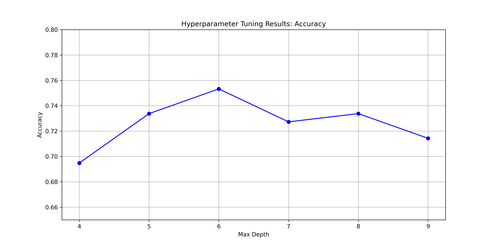
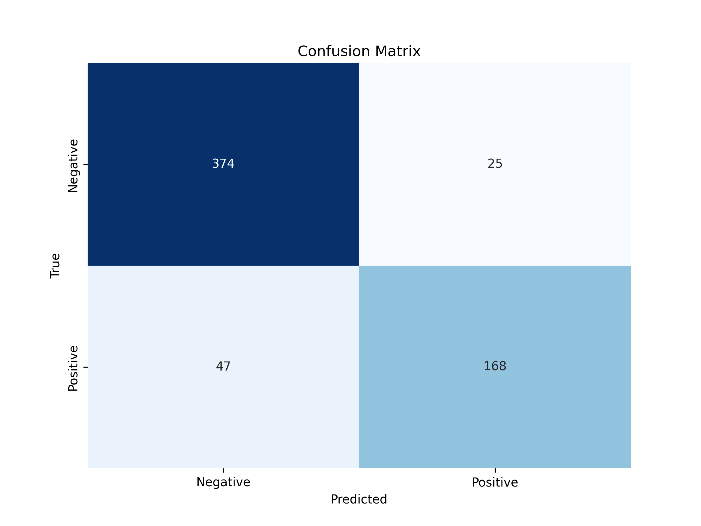

# Decision Tree Classifier for diabetes 
### Setting up
- 1 create a new folder and navigate into the folder
- 2 clone the repo(copy the code as below)
```bash
git clone https://github.com/Adityadln/Decision_tree_for_diabetes.git .
```
- 3 Getting the packages
```bash
pip install -r requirements.txt
``` 
- 4 Run the code
```bash
python3 Decision_tree.py
```
- 5 initially the graphs folder will be empty but upon running there will be two graphs.
- 6 The metrics and the decision tree split will be printed onto the terminal.

### Data
- 1 the data is taken from Kaggle,below is the url
```bash
https://www.kaggle.com/datasets/mathchi/diabetes-data-set
```

### graphs


